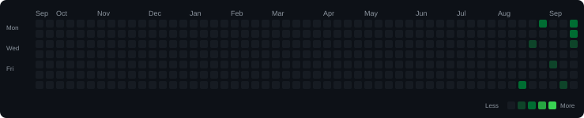

# ⚡ Coding Solutions Portfolio

> Automatically organized, analyzed, and updated by **CodeVault**.

---

## 📊 Overview

| Metric | Count |
| --- | ---: |
| 🏆 Total Solved | 6 |
| 🔵 Basic | 1 |
| 🟢 Easy | 5 |
| 🟠 Medium | 0 |
| 🔴 Hard | 0 |

## 📈 Progress

| Difficulty | Progress | Solved |
| --- | --- | ---: |
| 🔵 Basic | ███░░░░░░░░░░░░░░░░░ 17% | 1/6 |
| 🟢 Easy | █████████████████░░░ 83% | 5/6 |
| 🟠 Medium | ░░░░░░░░░░░░░░░░░░░░ 0% | 0/6 |
| 🔴 Hard | ░░░░░░░░░░░░░░░░░░░░ 0% | 0/6 |

## 🔥 Coding Activity

## 🧩 Pattern & Topic Index

| Pattern | Problems |
| --- | ---: |
| [Hash Map](patterns/Hash%20Map.md) | 2 |

| Topic | Problems |
| --- | ---: |
| [Array](topics/Array.md) | 2 |

## 💻 Languages

| Language | Problems |
| --- | ---: |
| Java | 5 |
| C++ | 1 |

## 🌐 Platforms

| Platform | Problems |
| --- | ---: |
| LeetCode | 3 |
| HackerRank | 2 |
| gfg | 1 |

## 🕒 Recently Solved

| Problem | Difficulty | Language | Platform |
| --- | --- | --- | --- |
| [Two Sum](LeetCode/C++/easy/Two-Sum/README.md) | Easy | C++ | LeetCode |
| [Remove Duplicates from Sorted Array](LeetCode/Java/easy/Remove-Duplicates-from-Sorted-Array/README.md) | Easy | Java | LeetCode |
| [ Java Stdin and Stdout I](HackerRank/Java/Easy/Java-Stdin-and-Stdout-I/README.md) | Easy | Java | HackerRank |
| [Welcome to Java!](HackerRank/Java/Easy/Welcome-to-Java!/README.md) | Easy | Java | HackerRank |
| [Array Search](gfg/Java/Basic/Array-Search/README.md) | Basic | Java | gfg |
| [Two Sum](LeetCode/Java/easy/Two-Sum/README.md) | Easy | Java | LeetCode |

## 🗂 Repository

- 📚 [Solution Index](.codevault/index.json)
- 🧩 [Patterns](patterns/)
- 📚 [Topics](topics/)

---

### 🤖 Powered by CodeVault

This README is generated automatically from the CodeVault repository index.
